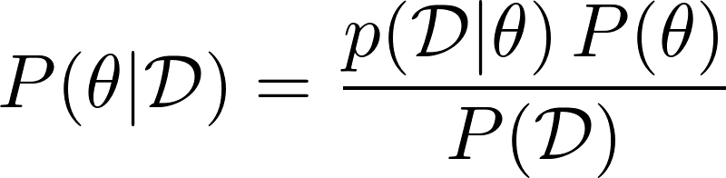

# Statistical Modelling Examples

<i>All we need is just <i>

---

## Examples

PyStan examples includes these methods:

* Linear Regression
* Multiple Linear Regression
* Robust Regression
* Logistic Regression
* Multinomial Logistic Regression
* Ordered Logistic Regression
* One-way ANOVA
* Two-way ANOVA

StatsModels examples includes these methods:

* Multiple linear regression with interaction terms

## Helper Functions for PyStan

* Pareto smoothed importance sampling (PSIS) and PSIS leave-one-out cross-validation reference code, [Link](https://github.com/avehtari/PSIS).
* stan_utility.py (Inference case studies in jupyter), [Link](https://github.com/betanalpha/jupyter_case_studies).

## Useful Resources

* Stan Reference Manual [Link](https://github.com/stan-dev/stan/releases/download/v2.17.0/stan-reference-2.17.0.pdf)
* PyStan Getting Started [Link](https://pystan.readthedocs.io/en/latest/getting_started.html)
* Stan example models [Link](https://github.com/stan-dev/example-models/tree/master/misc)
* Prior choices [Link](https://github.com/stan-dev/stan/wiki/Prior-Choice-Recommendations)
* Glossary of statistical terms [Link](https://www.stat.berkeley.edu/~stark/SticiGui/Text/gloss.htm)
* R datasets [Link](https://vincentarelbundock.github.io/Rdatasets/datasets.html)
* Salvatier J, Wiecki TV, Fonnesbeck C. (2016) Probabilistic programming in Python using PyMC3. PeerJ Computer Science 2:e55 https://doi.org/10.7717/peerj-cs.55 [Link](https://peerj.com/articles/cs-55/)

## Books

* Korner-Nievergelt, F., Korner-Nievergelt, P., Roth, T., Almasi, B., Felten, S. V., & Guélat, J. (2016). Bayesian data analysis in ecology using linear models with R, BUGS and Stan. Amsterdam: Elsevier/Academic Press.
