Case Study 1 - Diabetes dataset
================
Murat Koptur
26 Ağustos 2018

``` r
library(dplyr)
library(fastDummies)
library(GGally)
library(lavaan)
library(loo)
library(magrittr)
library(mice)
library(psych)
library(rstanarm)
library(semPlot)
```

``` r
# http://biostat.mc.vanderbilt.edu/wiki/Main/DataSets
load("./data/diabetes.sav")
```

``` r
str(diabetes)
```

    ## 'data.frame':    403 obs. of  19 variables:
    ##  $ id      : 'labelled' int  1000 1001 1002 1003 1005 1008 1011 1015 1016 1022 ...
    ##   ..- attr(*, "label")= chr "Subject ID"
    ##  $ chol    : 'labelled' int  203 165 228 78 249 248 195 227 177 263 ...
    ##   ..- attr(*, "label")= chr "Total Cholesterol"
    ##  $ stab.glu: 'labelled' int  82 97 92 93 90 94 92 75 87 89 ...
    ##   ..- attr(*, "label")= chr "Stabilized Glucose"
    ##  $ hdl     : 'labelled' int  56 24 37 12 28 69 41 44 49 40 ...
    ##   ..- attr(*, "label")= chr "High Density Lipoprotein"
    ##  $ ratio   : 'labelled' num  3.6 6.9 6.2 6.5 8.9 ...
    ##   ..- attr(*, "label")= chr "Cholesterol/HDL Ratio"
    ##  $ glyhb   : 'labelled' num  4.31 4.44 4.64 4.63 7.72 ...
    ##   ..- attr(*, "label")= chr "Glycosolated Hemoglobin"
    ##  $ location: Factor w/ 2 levels "Buckingham","Louisa": 1 1 1 1 1 1 1 1 1 1 ...
    ##  $ age     : int  46 29 58 67 64 34 30 37 45 55 ...
    ##   ..- attr(*, "units")= chr "years"
    ##  $ gender  : Factor w/ 2 levels "male","female": 2 2 2 1 1 1 1 1 1 2 ...
    ##  $ height  : int  62 64 61 67 68 71 69 59 69 63 ...
    ##   ..- attr(*, "units")= chr "inches"
    ##  $ weight  : int  121 218 256 119 183 190 191 170 166 202 ...
    ##   ..- attr(*, "units")= chr "pounds"
    ##  $ frame   : Factor w/ 3 levels "small","medium",..: 2 3 3 3 2 3 2 2 3 1 ...
    ##  $ bp.1s   : 'labelled' int  118 112 190 110 138 132 161 NA 160 108 ...
    ##   ..- attr(*, "label")= chr "First Systolic Blood Pressure"
    ##  $ bp.1d   : 'labelled' int  59 68 92 50 80 86 112 NA 80 72 ...
    ##   ..- attr(*, "label")= chr "First Diastolic Blood Pressure"
    ##  $ bp.2s   : 'labelled' int  NA NA 185 NA NA NA 161 NA 128 NA ...
    ##   ..- attr(*, "label")= chr "Second Systolic Blood Pressure"
    ##   ..- attr(*, "comment")= chr "equals first measurement if it was not high"
    ##  $ bp.2d   : 'labelled' int  NA NA 92 NA NA NA 112 NA 86 NA ...
    ##   ..- attr(*, "comment")= chr "equals first measurement if it was not high"
    ##   ..- attr(*, "label")= chr "Second Diastolic Blood Pressure"
    ##  $ waist   : int  29 46 49 33 44 36 46 34 34 45 ...
    ##   ..- attr(*, "units")= chr "inches"
    ##  $ hip     : int  38 48 57 38 41 42 49 39 40 50 ...
    ##   ..- attr(*, "units")= chr "inches"
    ##  $ time.ppn: 'labelled' int  720 360 180 480 300 195 720 1020 300 240 ...
    ##   ..- attr(*, "label")= chr "Postprandial Time when Labs were Drawn"
    ##   ..- attr(*, "units")= chr "minutes"

``` r
# I'll not use location in this analysis
diabetes <- select(diabetes, -location, -id)
```

``` r
# Let's look at summary of data
summary(diabetes)
```

    ##       chol          stab.glu          hdl             ratio       
    ##  Min.   : 78.0   Min.   : 48.0   Min.   : 12.00   Min.   : 1.500  
    ##  1st Qu.:179.0   1st Qu.: 81.0   1st Qu.: 38.00   1st Qu.: 3.200  
    ##  Median :204.0   Median : 89.0   Median : 46.00   Median : 4.200  
    ##  Mean   :207.8   Mean   :106.7   Mean   : 50.45   Mean   : 4.522  
    ##  3rd Qu.:230.0   3rd Qu.:106.0   3rd Qu.: 59.00   3rd Qu.: 5.400  
    ##  Max.   :443.0   Max.   :385.0   Max.   :120.00   Max.   :19.300  
    ##  NA's   :1                       NA's   :1        NA's   :1       
    ##      glyhb            age           gender        height     
    ##  Min.   : 2.68   Min.   :19.00   male  :169   Min.   :52.00  
    ##  1st Qu.: 4.38   1st Qu.:34.00   female:234   1st Qu.:63.00  
    ##  Median : 4.84   Median :45.00                Median :66.00  
    ##  Mean   : 5.59   Mean   :46.85                Mean   :66.02  
    ##  3rd Qu.: 5.60   3rd Qu.:60.00                3rd Qu.:69.00  
    ##  Max.   :16.11   Max.   :92.00                Max.   :76.00  
    ##  NA's   :13                                   NA's   :5      
    ##      weight         frame         bp.1s           bp.1d       
    ##  Min.   : 99.0   small :104   Min.   : 90.0   Min.   : 48.00  
    ##  1st Qu.:151.0   medium:184   1st Qu.:121.2   1st Qu.: 75.00  
    ##  Median :172.5   large :103   Median :136.0   Median : 82.00  
    ##  Mean   :177.6   NA's  : 12   Mean   :136.9   Mean   : 83.32  
    ##  3rd Qu.:200.0                3rd Qu.:146.8   3rd Qu.: 90.00  
    ##  Max.   :325.0                Max.   :250.0   Max.   :124.00  
    ##  NA's   :1                    NA's   :5       NA's   :5       
    ##      bp.2s           bp.2d            waist           hip       
    ##  Min.   :110.0   Min.   : 60.00   Min.   :26.0   Min.   :30.00  
    ##  1st Qu.:138.0   1st Qu.: 84.00   1st Qu.:33.0   1st Qu.:39.00  
    ##  Median :149.0   Median : 92.00   Median :37.0   Median :42.00  
    ##  Mean   :152.4   Mean   : 92.52   Mean   :37.9   Mean   :43.04  
    ##  3rd Qu.:161.0   3rd Qu.:100.00   3rd Qu.:41.0   3rd Qu.:46.00  
    ##  Max.   :238.0   Max.   :124.00   Max.   :56.0   Max.   :64.00  
    ##  NA's   :262     NA's   :262      NA's   :2      NA's   :2      
    ##     time.ppn     
    ##  Min.   :   5.0  
    ##  1st Qu.:  90.0  
    ##  Median : 240.0  
    ##  Mean   : 341.2  
    ##  3rd Qu.: 517.5  
    ##  Max.   :1560.0  
    ##  NA's   :3

``` r
# Investigate NA counts
colSums(is.na(diabetes))
```

    ##     chol stab.glu      hdl    ratio    glyhb      age   gender   height 
    ##        1        0        1        1       13        0        0        5 
    ##   weight    frame    bp.1s    bp.1d    bp.2s    bp.2d    waist      hip 
    ##        1       12        5        5      262      262        2        2 
    ## time.ppn 
    ##        3

``` r
# bp.2s and bp.2d variables has too much missing values

# Glycosolated hemoglobin (glyhb) column has 13 NAs
# I'll drop these observations
diabetes <- filter(diabetes, !is.na(glyhb))
```

``` r
# impute 
md.pattern(diabetes)
```


    ##     stab.glu glyhb age gender chol hdl ratio weight waist hip time.ppn
    ## 130        1     1   1      1    1   1     1      1     1   1        1
    ## 236        1     1   1      1    1   1     1      1     1   1        1
    ## 6          1     1   1      1    1   1     1      1     1   1        1
    ## 3          1     1   1      1    1   1     1      1     1   1        1
    ## 3          1     1   1      1    1   1     1      1     1   1        1
    ## 4          1     1   1      1    1   1     1      1     1   1        1
    ## 1          1     1   1      1    1   1     1      1     1   1        1
    ## 1          1     1   1      1    1   1     1      1     1   1        0
    ## 1          1     1   1      1    1   1     1      1     1   1        0
    ## 1          1     1   1      1    1   1     1      1     1   1        0
    ## 1          1     1   1      1    1   1     1      1     0   0        1
    ## 1          1     1   1      1    1   1     1      1     0   0        1
    ## 1          1     1   1      1    1   1     1      0     1   1        1
    ## 1          1     1   1      1    0   0     0      1     1   1        1
    ##            0     0   0      0    1   1     1      1     2   2        3
    ##     height bp.1s bp.1d frame bp.2s bp.2d    
    ## 130      1     1     1     1     1     1   0
    ## 236      1     1     1     1     0     0   2
    ## 6        1     1     1     0     1     1   1
    ## 3        1     1     1     0     0     0   3
    ## 3        1     0     0     1     0     0   4
    ## 4        0     1     1     1     0     0   3
    ## 1        0     0     0     0     0     0   6
    ## 1        1     1     1     1     1     1   1
    ## 1        1     1     1     0     0     0   4
    ## 1        1     0     0     1     0     0   5
    ## 1        1     1     1     1     1     1   2
    ## 1        1     1     1     1     0     0   4
    ## 1        1     1     1     1     0     0   3
    ## 1        1     1     1     1     0     0   5
    ##          5     5     5    11   252   252 541

``` r
diabetes_imp <-
  mice(
    data = diabetes,
    m = 5,
    maxit = 50,
    method = "pmm"
  )
```

``` r
# Take first imputed dataset (we have 5 imputed datasets, m=5)
diabetes_completed <- complete(diabetes_imp, 1)
```

``` r
# Investigate NA counts again
colSums(is.na(diabetes_completed))
```

    ##     chol stab.glu      hdl    ratio    glyhb      age   gender   height 
    ##        0        0        0        0        0        0        0        0 
    ##   weight    frame    bp.1s    bp.1d    bp.2s    bp.2d    waist      hip 
    ##        0        0        0        0        0        0        0        0 
    ## time.ppn 
    ##        0

``` r
# correlation analysis
ggcorr(diabetes_completed, label = TRUE, label_alpha = .7)
```

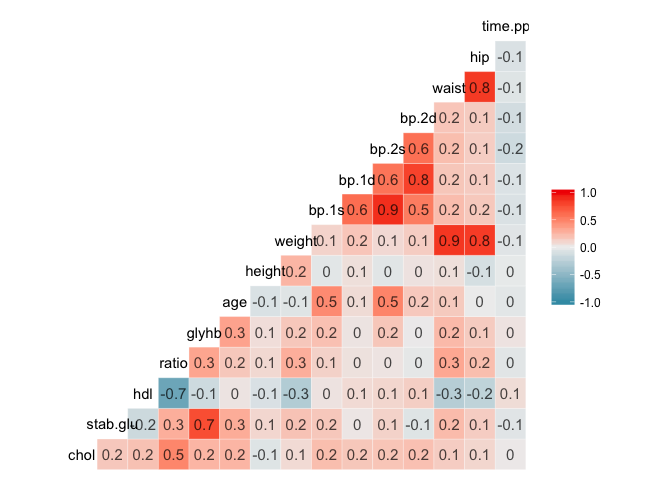

``` r
corr_table <-
  cor(diabetes_completed[, sapply(diabetes_completed, is.numeric)])
subset(as.data.frame(as.table(corr_table)), abs(Freq) > 0.5)
```

    ##         Var1     Var2       Freq
    ## 1       chol     chol  1.0000000
    ## 17  stab.glu stab.glu  1.0000000
    ## 20     glyhb stab.glu  0.7492355
    ## 33       hdl      hdl  1.0000000
    ## 34     ratio      hdl -0.6826599
    ## 48       hdl    ratio -0.6826599
    ## 49     ratio    ratio  1.0000000
    ## 62  stab.glu    glyhb  0.7492355
    ## 65     glyhb    glyhb  1.0000000
    ## 81       age      age  1.0000000
    ## 97    height   height  1.0000000
    ## 113   weight   weight  1.0000000
    ## 118    waist   weight  0.8522011
    ## 119      hip   weight  0.8307025
    ## 129    bp.1s    bp.1s  1.0000000
    ## 130    bp.1d    bp.1s  0.6054981
    ## 131    bp.2s    bp.1s  0.8778776
    ## 132    bp.2d    bp.1s  0.5162788
    ## 144    bp.1s    bp.1d  0.6054981
    ## 145    bp.1d    bp.1d  1.0000000
    ## 146    bp.2s    bp.1d  0.5814284
    ## 147    bp.2d    bp.1d  0.8272843
    ## 159    bp.1s    bp.2s  0.8778776
    ## 160    bp.1d    bp.2s  0.5814284
    ## 161    bp.2s    bp.2s  1.0000000
    ## 162    bp.2d    bp.2s  0.5746704
    ## 174    bp.1s    bp.2d  0.5162788
    ## 175    bp.1d    bp.2d  0.8272843
    ## 176    bp.2s    bp.2d  0.5746704
    ## 177    bp.2d    bp.2d  1.0000000
    ## 188   weight    waist  0.8522011
    ## 193    waist    waist  1.0000000
    ## 194      hip    waist  0.8341216
    ## 203   weight      hip  0.8307025
    ## 208    waist      hip  0.8341216
    ## 209      hip      hip  1.0000000
    ## 225 time.ppn time.ppn  1.0000000

``` r
# since bp.2d and bp.2s seems highly correlated with bp.1d and bp.1s and 
# they have a lot of missing values, I decided to discard them from analysis 

# also, I'll create two new variables,
# BMI (body mass index) and waist-to-hip ratio

diabetes_completed$bmi <-
  (diabetes_completed$weight / (diabetes_completed$height ** 2) * 703)
diabetes_completed$waist_to_hip_rat <-
  diabetes_completed$waist / diabetes_completed$hip

# take a subset of uncorrelated variables
diabetes_completed_subset <- select(
  diabetes_completed,
  chol,
  ratio,
  glyhb,
  age,
  gender,
  bmi,
  waist_to_hip_rat,
  frame,
  bp.1s,
  bp.1d,
  time.ppn
)
head(diabetes_completed_subset)
```

    ##   chol ratio glyhb age gender      bmi waist_to_hip_rat  frame bp.1s bp.1d
    ## 1  203   3.6  4.31  46 female 22.12877        0.7631579 medium   118    59
    ## 2  165   6.9  4.44  29 female 37.41553        0.9583333  large   112    68
    ## 3  228   6.2  4.64  58 female 48.36549        0.8596491  large   190    92
    ## 4   78   6.5  4.63  67   male 18.63600        0.8684211  large   110    50
    ## 5  249   8.9  7.72  64   male 27.82202        1.0731707 medium   138    80
    ## 6  248   3.6  4.81  34   male 26.49673        0.8571429  large   132    86
    ##   time.ppn
    ## 1      720
    ## 2      360
    ## 3      180
    ## 4      480
    ## 5      300
    ## 6      195

``` r
# pairs plot
ggpairs(diabetes_completed_subset)
```

    ## `stat_bin()` using `bins = 30`. Pick better value with `binwidth`.
    ## `stat_bin()` using `bins = 30`. Pick better value with `binwidth`.
    ## `stat_bin()` using `bins = 30`. Pick better value with `binwidth`.
    ## `stat_bin()` using `bins = 30`. Pick better value with `binwidth`.
    ## `stat_bin()` using `bins = 30`. Pick better value with `binwidth`.
    ## `stat_bin()` using `bins = 30`. Pick better value with `binwidth`.
    ## `stat_bin()` using `bins = 30`. Pick better value with `binwidth`.
    ## `stat_bin()` using `bins = 30`. Pick better value with `binwidth`.
    ## `stat_bin()` using `bins = 30`. Pick better value with `binwidth`.
    ## `stat_bin()` using `bins = 30`. Pick better value with `binwidth`.
    ## `stat_bin()` using `bins = 30`. Pick better value with `binwidth`.
    ## `stat_bin()` using `bins = 30`. Pick better value with `binwidth`.
    ## `stat_bin()` using `bins = 30`. Pick better value with `binwidth`.
    ## `stat_bin()` using `bins = 30`. Pick better value with `binwidth`.
    ## `stat_bin()` using `bins = 30`. Pick better value with `binwidth`.
    ## `stat_bin()` using `bins = 30`. Pick better value with `binwidth`.
    ## `stat_bin()` using `bins = 30`. Pick better value with `binwidth`.
    ## `stat_bin()` using `bins = 30`. Pick better value with `binwidth`.

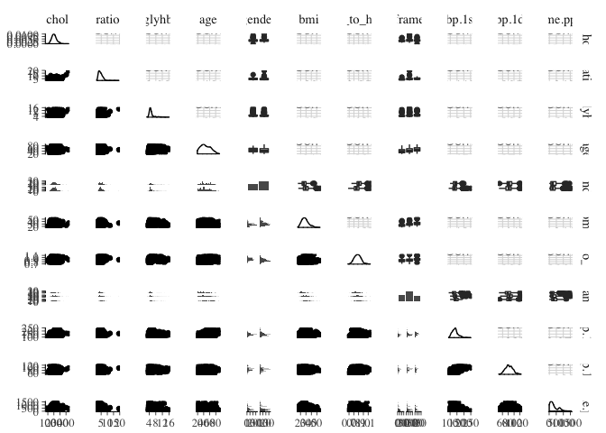

``` r
# standardize all variables
diabetes_completed_subset %<>%
  mutate_at(
    funs(scale),
    .vars = c(
      "chol",
      "ratio",
      "glyhb",
      "age",
      "bmi",
      "waist_to_hip_rat",
      "bp.1s",
      "bp.1d",
      "time.ppn"
    )
  )
```

``` r
# Create dummy variables for gender and frame
library(fastDummies)
diabetes_completed_subset <-
  dummy_cols(diabetes_completed_subset, remove_first_dummy = TRUE)
diabetes_completed_subset <-
  select(diabetes_completed_subset,-gender,-frame)
head(diabetes_completed_subset)
```

    ##          chol      ratio      glyhb         age        bmi
    ## 1 -0.09319585 -0.5301616 -0.5706645 -0.04711384 -0.9973448
    ## 2 -0.94314197  1.3678022 -0.5126959 -1.08143433  1.3055456
    ## 3  0.46597923  0.9652036 -0.4235136  0.68299474  2.9551156
    ## 4 -2.88907124  1.1377459 -0.4279726  1.23057617 -1.5235175
    ## 5  0.93568630  2.5180829  0.9498954  1.04804903 -0.1396797
    ## 6  0.91331929 -0.5301616 -0.3477085 -0.77722242 -0.3393293
    ##   waist_to_hip_rat       bp.1s      bp.1d    time.ppn gender_male
    ## 1       -1.6083402 -0.82988906 -1.7821860  1.25031434           0
    ## 2        1.0550300 -1.09181790 -1.1181935  0.08200624           0
    ## 3       -0.2916179  2.31325699  0.6524530 -0.50214781           0
    ## 4       -0.1719158 -1.17912751 -2.4461784  0.47144227           1
    ## 5        2.6221047  0.04320706 -0.2328703 -0.11271177           1
    ## 6       -0.3258185 -0.21872177  0.2097913 -0.45346830           1
    ##   frame_large frame_small
    ## 1           0           0
    ## 2           1           0
    ## 3           1           0
    ## 4           1           0
    ## 5           0           0
    ## 6           1           0

``` r
# Explonatory Factor analysis
fa.parallel(select(diabetes_completed_subset,-glyhb))
```

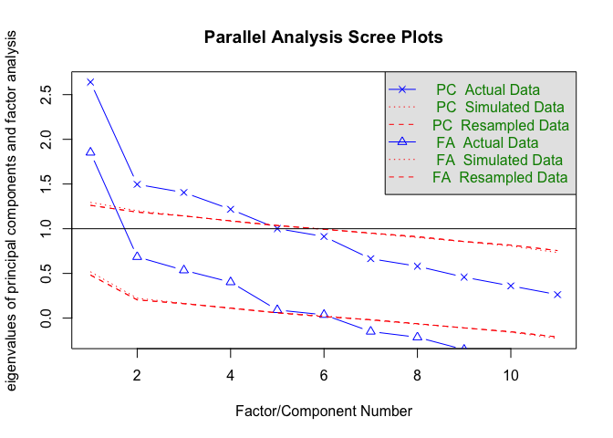

    ## Parallel analysis suggests that the number of factors =  6  and the number of components =  4

``` r
diabetes_completed_subset_fi <-
  fa(
    select(diabetes_completed_subset,-glyhb),
    nfactors = 6,
    fm = "pa",
    max.iter = 200
  )
```

``` r
fa.diagram(diabetes_completed_subset_fi)
```

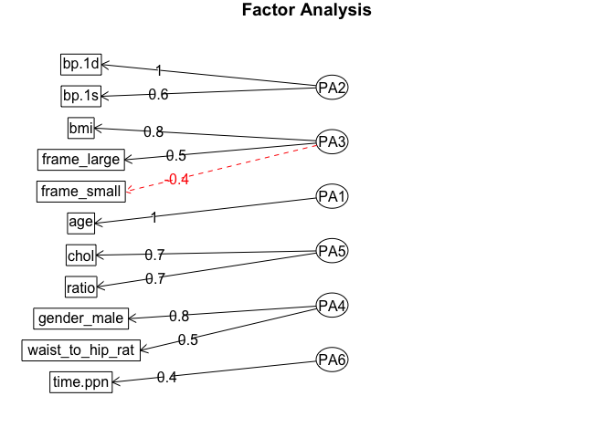

``` r
fl <- round(unclass(diabetes_completed_subset_fi$loadings), 2)
fl
```

    ##                    PA2   PA3   PA1   PA5   PA4   PA6
    ## chol              0.07 -0.10  0.05  0.75 -0.12  0.09
    ## ratio            -0.08  0.17 -0.01  0.67  0.19 -0.12
    ## age              -0.02 -0.02  0.99  0.02 -0.01  0.00
    ## bmi               0.06  0.84 -0.06  0.03 -0.15 -0.04
    ## waist_to_hip_rat  0.01  0.19  0.18  0.08  0.47 -0.05
    ## bp.1s             0.58  0.05  0.38  0.02 -0.02  0.00
    ## bp.1d             0.98  0.01 -0.07  0.00  0.03  0.00
    ## time.ppn         -0.09 -0.04 -0.10  0.04 -0.03  0.36
    ## gender_male       0.06 -0.15 -0.04  0.00  0.79  0.04
    ## frame_large      -0.07  0.49  0.15 -0.09  0.31  0.18
    ## frame_small      -0.05 -0.42 -0.03 -0.14 -0.13 -0.29

``` r
# Let's start to build models
model1 <- stan_glm('glyhb ~ .', data = diabetes_completed_subset)
```

``` r
model1
```

    ## stan_glm
    ##  family:       gaussian [identity]
    ##  formula:      "glyhb ~ ."
    ##  observations: 390
    ##  predictors:   12
    ## ------
    ##                  Median MAD_SD
    ## (Intercept)      0.0    0.1   
    ## chol             0.1    0.1   
    ## ratio            0.2    0.1   
    ## age              0.3    0.1   
    ## bmi              0.1    0.1   
    ## waist_to_hip_rat 0.0    0.1   
    ## bp.1s            0.1    0.1   
    ## bp.1d            0.0    0.1   
    ## time.ppn         0.1    0.0   
    ## gender_male      0.0    0.1   
    ## frame_large      0.0    0.1   
    ## frame_small      0.0    0.1   
    ## sigma            0.9    0.0   
    ## 
    ## Sample avg. posterior predictive distribution of y:
    ##          Median MAD_SD
    ## mean_PPD 0.0    0.1   
    ## 
    ## ------
    ## For info on the priors used see help('prior_summary.stanreg').

``` r
summary(model1)
```

    ## 
    ## Model Info:
    ## 
    ##  function:     stan_glm
    ##  family:       gaussian [identity]
    ##  formula:      "glyhb ~ ."
    ##  algorithm:    sampling
    ##  priors:       see help('prior_summary')
    ##  sample:       4000 (posterior sample size)
    ##  observations: 390
    ##  predictors:   12
    ## 
    ## Estimates:
    ##                    mean   sd     2.5%   25%    50%    75%    97.5%
    ## (Intercept)         0.0    0.1   -0.2   -0.1    0.0    0.1    0.2 
    ## chol                0.1    0.1   -0.1    0.0    0.1    0.1    0.2 
    ## ratio               0.2    0.1    0.1    0.2    0.2    0.3    0.3 
    ## age                 0.3    0.1    0.1    0.2    0.3    0.3    0.4 
    ## bmi                 0.1    0.1    0.0    0.0    0.1    0.1    0.2 
    ## waist_to_hip_rat    0.0    0.1   -0.1    0.0    0.0    0.1    0.2 
    ## bp.1s               0.1    0.1   -0.1    0.0    0.1    0.1    0.2 
    ## bp.1d               0.0    0.1   -0.2   -0.1    0.0    0.0    0.1 
    ## time.ppn            0.1    0.0    0.0    0.0    0.1    0.1    0.1 
    ## gender_male         0.0    0.1   -0.2    0.0    0.0    0.1    0.2 
    ## frame_large         0.0    0.1   -0.3   -0.1    0.0    0.0    0.2 
    ## frame_small         0.0    0.1   -0.2   -0.1    0.0    0.1    0.2 
    ## sigma               0.9    0.0    0.8    0.9    0.9    0.9    1.0 
    ## mean_PPD            0.0    0.1   -0.1    0.0    0.0    0.0    0.1 
    ## log-posterior    -529.0    2.6 -534.8 -530.6 -528.6 -527.1 -524.9 
    ## 
    ## Diagnostics:
    ##                  mcse Rhat n_eff
    ## (Intercept)      0.0  1.0  4000 
    ## chol             0.0  1.0  4000 
    ## ratio            0.0  1.0  4000 
    ## age              0.0  1.0  4000 
    ## bmi              0.0  1.0  4000 
    ## waist_to_hip_rat 0.0  1.0  4000 
    ## bp.1s            0.0  1.0  3638 
    ## bp.1d            0.0  1.0  3939 
    ## time.ppn         0.0  1.0  4000 
    ## gender_male      0.0  1.0  4000 
    ## frame_large      0.0  1.0  4000 
    ## frame_small      0.0  1.0  4000 
    ## sigma            0.0  1.0  4000 
    ## mean_PPD         0.0  1.0  4000 
    ## log-posterior    0.1  1.0  1764 
    ## 
    ## For each parameter, mcse is Monte Carlo standard error, n_eff is a crude measure of effective sample size, and Rhat is the potential scale reduction factor on split chains (at convergence Rhat=1).

``` r
par(mfrow = c(2, 2), mar = c(3, 5, 3, 3))
plot(model1)
```

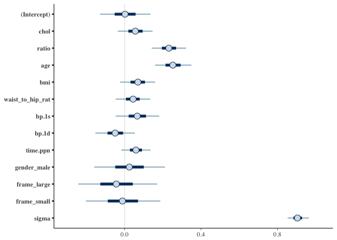

``` r
model2 <-
  stan_glm('glyhb ~  ratio + age', data = diabetes_completed_subset)
```

``` r
model2
```

    ## stan_glm
    ##  family:       gaussian [identity]
    ##  formula:      "glyhb ~ ratio + age"
    ##  observations: 390
    ##  predictors:   3
    ## ------
    ##             Median MAD_SD
    ## (Intercept) 0.0    0.0   
    ## ratio       0.3    0.0   
    ## age         0.3    0.0   
    ## sigma       0.9    0.0   
    ## 
    ## Sample avg. posterior predictive distribution of y:
    ##          Median MAD_SD
    ## mean_PPD 0.0    0.1   
    ## 
    ## ------
    ## For info on the priors used see help('prior_summary.stanreg').

``` r
summary(model2)
```

    ## 
    ## Model Info:
    ## 
    ##  function:     stan_glm
    ##  family:       gaussian [identity]
    ##  formula:      "glyhb ~ ratio + age"
    ##  algorithm:    sampling
    ##  priors:       see help('prior_summary')
    ##  sample:       4000 (posterior sample size)
    ##  observations: 390
    ##  predictors:   3
    ## 
    ## Estimates:
    ##                 mean   sd     2.5%   25%    50%    75%    97.5%
    ## (Intercept)      0.0    0.0   -0.1    0.0    0.0    0.0    0.1 
    ## ratio            0.3    0.0    0.2    0.3    0.3    0.3    0.4 
    ## age              0.3    0.0    0.2    0.3    0.3    0.3    0.4 
    ## sigma            0.9    0.0    0.8    0.9    0.9    0.9    1.0 
    ## mean_PPD         0.0    0.1   -0.1    0.0    0.0    0.0    0.1 
    ## log-posterior -519.3    1.4 -522.8 -520.1 -519.0 -518.3 -517.6 
    ## 
    ## Diagnostics:
    ##               mcse Rhat n_eff
    ## (Intercept)   0.0  1.0  4000 
    ## ratio         0.0  1.0  4000 
    ## age           0.0  1.0  4000 
    ## sigma         0.0  1.0  4000 
    ## mean_PPD      0.0  1.0  4000 
    ## log-posterior 0.0  1.0  1855 
    ## 
    ## For each parameter, mcse is Monte Carlo standard error, n_eff is a crude measure of effective sample size, and Rhat is the potential scale reduction factor on split chains (at convergence Rhat=1).

``` r
par(mfrow = c(2, 2), mar = c(3, 5, 3, 3))
plot(model2)
```

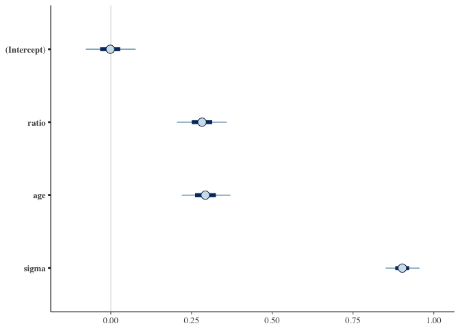

``` r
model3 <-
  stan_glm('glyhb ~ bmi + waist_to_hip_rat', data = diabetes_completed_subset)
```

``` r
model3
```

    ## stan_glm
    ##  family:       gaussian [identity]
    ##  formula:      "glyhb ~ bmi + waist_to_hip_rat"
    ##  observations: 390
    ##  predictors:   3
    ## ------
    ##                  Median MAD_SD
    ## (Intercept)      0.0    0.0   
    ## bmi              0.1    0.0   
    ## waist_to_hip_rat 0.2    0.1   
    ## sigma            1.0    0.0   
    ## 
    ## Sample avg. posterior predictive distribution of y:
    ##          Median MAD_SD
    ## mean_PPD 0.0    0.1   
    ## 
    ## ------
    ## For info on the priors used see help('prior_summary.stanreg').

``` r
summary(model3)
```

    ## 
    ## Model Info:
    ## 
    ##  function:     stan_glm
    ##  family:       gaussian [identity]
    ##  formula:      "glyhb ~ bmi + waist_to_hip_rat"
    ##  algorithm:    sampling
    ##  priors:       see help('prior_summary')
    ##  sample:       4000 (posterior sample size)
    ##  observations: 390
    ##  predictors:   3
    ## 
    ## Estimates:
    ##                    mean   sd     2.5%   25%    50%    75%    97.5%
    ## (Intercept)         0.0    0.0   -0.1    0.0    0.0    0.0    0.1 
    ## bmi                 0.1    0.1    0.0    0.1    0.1    0.1    0.2 
    ## waist_to_hip_rat    0.2    0.1    0.1    0.1    0.2    0.2    0.3 
    ## sigma               1.0    0.0    0.9    1.0    1.0    1.0    1.1 
    ## mean_PPD            0.0    0.1   -0.1    0.0    0.0    0.0    0.1 
    ## log-posterior    -551.6    1.5 -555.3 -552.3 -551.2 -550.5 -549.8 
    ## 
    ## Diagnostics:
    ##                  mcse Rhat n_eff
    ## (Intercept)      0.0  1.0  4000 
    ## bmi              0.0  1.0  4000 
    ## waist_to_hip_rat 0.0  1.0  4000 
    ## sigma            0.0  1.0  4000 
    ## mean_PPD         0.0  1.0  4000 
    ## log-posterior    0.0  1.0  1792 
    ## 
    ## For each parameter, mcse is Monte Carlo standard error, n_eff is a crude measure of effective sample size, and Rhat is the potential scale reduction factor on split chains (at convergence Rhat=1).

``` r
par(mfrow = c(2, 2), mar = c(3, 5, 3, 3))
plot(model3)
```

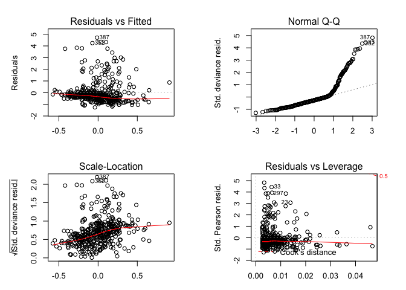

``` r
model4 <-
  stan_glm('glyhb ~ ratio + age + bmi + waist_to_hip_rat', data = diabetes_completed_subset)
```

``` r
model4
```

    ## stan_glm
    ##  family:       gaussian [identity]
    ##  formula:      "glyhb ~ ratio + age + bmi + waist_to_hip_rat"
    ##  observations: 390
    ##  predictors:   5
    ## ------
    ##                  Median MAD_SD
    ## (Intercept)      0.0    0.0   
    ## ratio            0.3    0.0   
    ## age              0.3    0.0   
    ## bmi              0.1    0.0   
    ## waist_to_hip_rat 0.0    0.1   
    ## sigma            0.9    0.0   
    ## 
    ## Sample avg. posterior predictive distribution of y:
    ##          Median MAD_SD
    ## mean_PPD 0.0    0.1   
    ## 
    ## ------
    ## For info on the priors used see help('prior_summary.stanreg').

``` r
summary(model4)
```

    ## 
    ## Model Info:
    ## 
    ##  function:     stan_glm
    ##  family:       gaussian [identity]
    ##  formula:      "glyhb ~ ratio + age + bmi + waist_to_hip_rat"
    ##  algorithm:    sampling
    ##  priors:       see help('prior_summary')
    ##  sample:       4000 (posterior sample size)
    ##  observations: 390
    ##  predictors:   5
    ## 
    ## Estimates:
    ##                    mean   sd     2.5%   25%    50%    75%    97.5%
    ## (Intercept)         0.0    0.0   -0.1    0.0    0.0    0.0    0.1 
    ## ratio               0.3    0.0    0.2    0.2    0.3    0.3    0.4 
    ## age                 0.3    0.0    0.2    0.3    0.3    0.3    0.4 
    ## bmi                 0.1    0.0    0.0    0.0    0.1    0.1    0.2 
    ## waist_to_hip_rat    0.0    0.0   -0.1    0.0    0.0    0.1    0.1 
    ## sigma               0.9    0.0    0.8    0.9    0.9    0.9    1.0 
    ## mean_PPD            0.0    0.1   -0.1    0.0    0.0    0.0    0.1 
    ## log-posterior    -521.0    1.7 -525.2 -521.9 -520.6 -519.7 -518.6 
    ## 
    ## Diagnostics:
    ##                  mcse Rhat n_eff
    ## (Intercept)      0.0  1.0  4000 
    ## ratio            0.0  1.0  4000 
    ## age              0.0  1.0  4000 
    ## bmi              0.0  1.0  4000 
    ## waist_to_hip_rat 0.0  1.0  4000 
    ## sigma            0.0  1.0  4000 
    ## mean_PPD         0.0  1.0  4000 
    ## log-posterior    0.0  1.0  1911 
    ## 
    ## For each parameter, mcse is Monte Carlo standard error, n_eff is a crude measure of effective sample size, and Rhat is the potential scale reduction factor on split chains (at convergence Rhat=1).

``` r
par(mfrow = c(2, 2), mar = c(3, 5, 3, 3))
plot(model4)
```

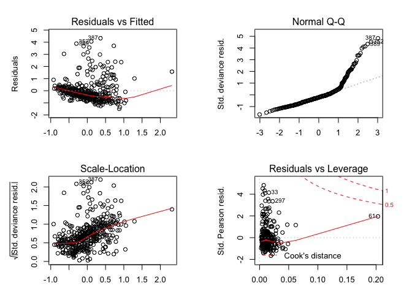

``` r
model5 <-
  stan_glm('glyhb ~ ratio + age + bmi', data = diabetes_completed_subset)
```

``` r
model5
```

    ## stan_glm
    ##  family:       gaussian [identity]
    ##  formula:      "glyhb ~ ratio + age + bmi"
    ##  observations: 390
    ##  predictors:   4
    ## ------
    ##             Median MAD_SD
    ## (Intercept) 0.0    0.0   
    ## ratio       0.3    0.0   
    ## age         0.3    0.0   
    ## bmi         0.1    0.0   
    ## sigma       0.9    0.0   
    ## 
    ## Sample avg. posterior predictive distribution of y:
    ##          Median MAD_SD
    ## mean_PPD 0.0    0.1   
    ## 
    ## ------
    ## For info on the priors used see help('prior_summary.stanreg').

``` r
summary(model5)
```

    ## 
    ## Model Info:
    ## 
    ##  function:     stan_glm
    ##  family:       gaussian [identity]
    ##  formula:      "glyhb ~ ratio + age + bmi"
    ##  algorithm:    sampling
    ##  priors:       see help('prior_summary')
    ##  sample:       4000 (posterior sample size)
    ##  observations: 390
    ##  predictors:   4
    ## 
    ## Estimates:
    ##                 mean   sd     2.5%   25%    50%    75%    97.5%
    ## (Intercept)      0.0    0.0   -0.1    0.0    0.0    0.0    0.1 
    ## ratio            0.3    0.0    0.2    0.2    0.3    0.3    0.4 
    ## age              0.3    0.0    0.2    0.3    0.3    0.3    0.4 
    ## bmi              0.1    0.0    0.0    0.0    0.1    0.1    0.2 
    ## sigma            0.9    0.0    0.8    0.9    0.9    0.9    1.0 
    ## mean_PPD         0.0    0.1   -0.1    0.0    0.0    0.0    0.1 
    ## log-posterior -519.8    1.5 -523.4 -520.6 -519.5 -518.7 -517.8 
    ## 
    ## Diagnostics:
    ##               mcse Rhat n_eff
    ## (Intercept)   0.0  1.0  4000 
    ## ratio         0.0  1.0  4000 
    ## age           0.0  1.0  4000 
    ## bmi           0.0  1.0  4000 
    ## sigma         0.0  1.0  4000 
    ## mean_PPD      0.0  1.0  4000 
    ## log-posterior 0.0  1.0  1941 
    ## 
    ## For each parameter, mcse is Monte Carlo standard error, n_eff is a crude measure of effective sample size, and Rhat is the potential scale reduction factor on split chains (at convergence Rhat=1).

``` r
par(mfrow = c(2, 2), mar = c(3, 5, 3, 3))
plot(model5)
```

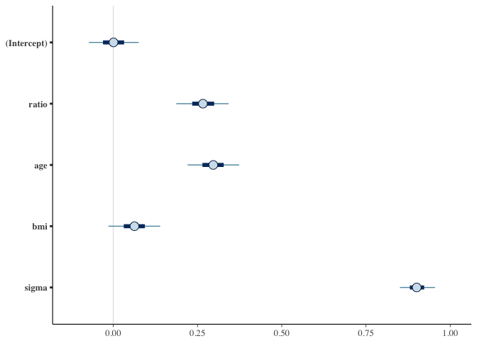

``` r
ic <- data.frame(
  Model = c("model1", "model2", "model3", "model4", "model5"),
  WAIC = c(waic(model1)$estimates[3,1], waic(model2)$estimates[3,1], waic(model3)$estimates[3,1], waic(model4)$estimates[3,1], waic(model5)$estimates[3,1]),
  stringsAsFactors = FALSE
)
```

``` r
ic
```

    ##    Model     WAIC
    ## 1 model1 1045.760
    ## 2 model2 1033.905
    ## 3 model3 1097.760
    ## 4 model4 1035.492
    ## 5 model5 1034.094

``` r
# Let's build a SEM model
library(lavaan)
semModel1 <- '
pa1 =~ age
pa2 =~ bp.1d + bp.1s
pa3 =~ bmi + frame_large + frame_small
pa4 =~ gender_male + waist_to_hip_rat
pa5 =~ ratio + chol
pa6 =~ time.ppn

glyhb ~ pa1 + pa2 + pa3 + pa4 + pa5 + pa6
'
fit1 <- sem(semModel1,
            data = diabetes_completed_subset)
```

    ## Warning in lav_object_post_check(object): lavaan WARNING: some estimated ov
    ## variances are negative

``` r
fit1
```

    ## lavaan 0.6-2 ended normally after 144 iterations
    ## 
    ##   Optimization method                           NLMINB
    ##   Number of free parameters                         42
    ## 
    ##   Number of observations                           390
    ## 
    ##   Estimator                                         ML
    ##   Model Fit Test Statistic                     178.781
    ##   Degrees of freedom                                36
    ##   P-value (Chi-square)                           0.000

``` r
semPaths(fit1)
```

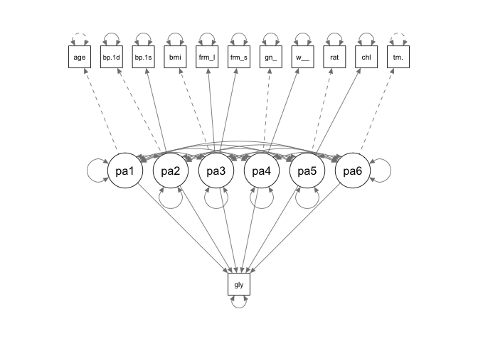

``` r
summary(fit1, standardized = TRUE, fit.measures = TRUE)
```

    ## lavaan 0.6-2 ended normally after 144 iterations
    ## 
    ##   Optimization method                           NLMINB
    ##   Number of free parameters                         42
    ## 
    ##   Number of observations                           390
    ## 
    ##   Estimator                                         ML
    ##   Model Fit Test Statistic                     178.781
    ##   Degrees of freedom                                36
    ##   P-value (Chi-square)                           0.000
    ## 
    ## Model test baseline model:
    ## 
    ##   Minimum Function Test Statistic              974.533
    ##   Degrees of freedom                                66
    ##   P-value                                        0.000
    ## 
    ## User model versus baseline model:
    ## 
    ##   Comparative Fit Index (CFI)                    0.843
    ##   Tucker-Lewis Index (TLI)                       0.712
    ## 
    ## Loglikelihood and Information Criteria:
    ## 
    ##   Loglikelihood user model (H0)              -5323.322
    ##   Loglikelihood unrestricted model (H1)      -5233.931
    ## 
    ##   Number of free parameters                         42
    ##   Akaike (AIC)                               10730.643
    ##   Bayesian (BIC)                             10897.222
    ##   Sample-size adjusted Bayesian (BIC)        10763.958
    ## 
    ## Root Mean Square Error of Approximation:
    ## 
    ##   RMSEA                                          0.101
    ##   90 Percent Confidence Interval          0.086  0.116
    ##   P-value RMSEA <= 0.05                          0.000
    ## 
    ## Standardized Root Mean Square Residual:
    ## 
    ##   SRMR                                           0.064
    ## 
    ## Parameter Estimates:
    ## 
    ##   Information                                 Expected
    ##   Information saturated (h1) model          Structured
    ##   Standard Errors                             Standard
    ## 
    ## Latent Variables:
    ##                    Estimate  Std.Err  z-value  P(>|z|)   Std.lv  Std.all
    ##   pa1 =~                                                                
    ##     age               1.000                               0.999    1.000
    ##   pa2 =~                                                                
    ##     bp.1d             1.000                               0.340    0.340
    ##     bp.1s             5.235    2.648    1.977    0.048    1.778    1.780
    ##   pa3 =~                                                                
    ##     bmi               1.000                               0.532    0.533
    ##     frame_large       0.483    0.072    6.705    0.000    0.257    0.586
    ##     frame_small      -0.543    0.080   -6.793    0.000   -0.289   -0.652
    ##   pa4 =~                                                                
    ##     gender_male       1.000                               0.157    0.320
    ##     waist_to_hp_rt    6.946    2.881    2.411    0.016    1.094    1.095
    ##   pa5 =~                                                                
    ##     ratio             1.000                               0.882    0.883
    ##     chol              0.612    0.106    5.760    0.000    0.539    0.540
    ##   pa6 =~                                                                
    ##     time.ppn          1.000                               0.999    1.000
    ## 
    ## Regressions:
    ##                    Estimate  Std.Err  z-value  P(>|z|)   Std.lv  Std.all
    ##   glyhb ~                                                               
    ##     pa1               0.257    0.049    5.254    0.000    0.256    0.257
    ##     pa2               0.055    0.061    0.892    0.372    0.019    0.019
    ##     pa3               0.063    0.134    0.469    0.639    0.033    0.033
    ##     pa4               0.132    0.290    0.456    0.648    0.021    0.021
    ##     pa5               0.351    0.090    3.916    0.000    0.310    0.310
    ##     pa6               0.056    0.046    1.222    0.222    0.056    0.056
    ## 
    ## Covariances:
    ##                    Estimate  Std.Err  z-value  P(>|z|)   Std.lv  Std.all
    ##   pa1 ~~                                                                
    ##     pa2               0.088    0.050    1.766    0.077    0.259    0.259
    ##     pa3               0.130    0.037    3.510    0.000    0.244    0.244
    ##     pa4               0.040    0.019    2.163    0.031    0.256    0.256
    ##     pa5               0.187    0.051    3.681    0.000    0.213    0.213
    ##     pa6              -0.039    0.051   -0.778    0.437   -0.039   -0.039
    ##   pa2 ~~                                                                
    ##     pa3               0.019    0.012    1.564    0.118    0.108    0.108
    ##     pa4               0.003    0.003    1.249    0.212    0.059    0.059
    ##     pa5               0.023    0.015    1.499    0.134    0.077    0.077
    ##     pa6              -0.008    0.010   -0.840    0.401   -0.024   -0.024
    ##   pa3 ~~                                                                
    ##     pa4               0.027    0.013    2.113    0.035    0.322    0.322
    ##     pa5               0.182    0.039    4.618    0.000    0.388    0.388
    ##     pa6               0.036    0.034    1.062    0.288    0.069    0.069
    ##   pa4 ~~                                                                
    ##     pa5               0.034    0.016    2.109    0.035    0.248    0.248
    ##     pa6               0.000    0.007    0.003    0.998    0.000    0.000
    ##   pa5 ~~                                                                
    ##     pa6              -0.037    0.050   -0.733    0.464   -0.042   -0.042
    ## 
    ## Variances:
    ##                    Estimate  Std.Err  z-value  P(>|z|)   Std.lv  Std.all
    ##    .age               0.000                               0.000    0.000
    ##    .bp.1d             0.882    0.084   10.560    0.000    0.882    0.884
    ##    .bp.1s            -2.164    1.506   -1.437    0.151   -2.164   -2.170
    ##    .bmi               0.714    0.065   10.975    0.000    0.714    0.716
    ##    .frame_large       0.126    0.013    9.944    0.000    0.126    0.656
    ##    .frame_small       0.113    0.014    8.366    0.000    0.113    0.575
    ##    .gender_male       0.218    0.018   11.936    0.000    0.218    0.898
    ##    .waist_to_hp_rt   -0.199    0.458   -0.435    0.664   -0.199   -0.200
    ##    .ratio             0.219    0.124    1.771    0.077    0.219    0.220
    ##    .chol              0.706    0.068   10.337    0.000    0.706    0.708
    ##    .time.ppn          0.000                               0.000    0.000
    ##    .glyhb             0.777    0.059   13.243    0.000    0.777    0.779
    ##     pa1               0.997    0.071   13.964    0.000    1.000    1.000
    ##     pa2               0.115    0.064    1.802    0.072    1.000    1.000
    ##     pa3               0.283    0.064    4.423    0.000    1.000    1.000
    ##     pa4               0.025    0.012    2.035    0.042    1.000    1.000
    ##     pa5               0.778    0.141    5.508    0.000    1.000    1.000
    ##     pa6               0.997    0.071   13.964    0.000    1.000    1.000

``` r
parameterEstimates(fit1)
```

    ##                 lhs op              rhs    est    se      z pvalue
    ## 1               pa1 =~              age  1.000 0.000     NA     NA
    ## 2               pa2 =~            bp.1d  1.000 0.000     NA     NA
    ## 3               pa2 =~            bp.1s  5.235 2.648  1.977  0.048
    ## 4               pa3 =~              bmi  1.000 0.000     NA     NA
    ## 5               pa3 =~      frame_large  0.483 0.072  6.705  0.000
    ## 6               pa3 =~      frame_small -0.543 0.080 -6.793  0.000
    ## 7               pa4 =~      gender_male  1.000 0.000     NA     NA
    ## 8               pa4 =~ waist_to_hip_rat  6.946 2.881  2.411  0.016
    ## 9               pa5 =~            ratio  1.000 0.000     NA     NA
    ## 10              pa5 =~             chol  0.612 0.106  5.760  0.000
    ## 11              pa6 =~         time.ppn  1.000 0.000     NA     NA
    ## 12            glyhb  ~              pa1  0.257 0.049  5.254  0.000
    ## 13            glyhb  ~              pa2  0.055 0.061  0.892  0.372
    ## 14            glyhb  ~              pa3  0.063 0.134  0.469  0.639
    ## 15            glyhb  ~              pa4  0.132 0.290  0.456  0.648
    ## 16            glyhb  ~              pa5  0.351 0.090  3.916  0.000
    ## 17            glyhb  ~              pa6  0.056 0.046  1.222  0.222
    ## 18              age ~~              age  0.000 0.000     NA     NA
    ## 19            bp.1d ~~            bp.1d  0.882 0.084 10.560  0.000
    ## 20            bp.1s ~~            bp.1s -2.164 1.506 -1.437  0.151
    ## 21              bmi ~~              bmi  0.714 0.065 10.975  0.000
    ## 22      frame_large ~~      frame_large  0.126 0.013  9.944  0.000
    ## 23      frame_small ~~      frame_small  0.113 0.014  8.366  0.000
    ## 24      gender_male ~~      gender_male  0.218 0.018 11.936  0.000
    ## 25 waist_to_hip_rat ~~ waist_to_hip_rat -0.199 0.458 -0.435  0.664
    ## 26            ratio ~~            ratio  0.219 0.124  1.771  0.077
    ## 27             chol ~~             chol  0.706 0.068 10.337  0.000
    ## 28         time.ppn ~~         time.ppn  0.000 0.000     NA     NA
    ## 29            glyhb ~~            glyhb  0.777 0.059 13.243  0.000
    ## 30              pa1 ~~              pa1  0.997 0.071 13.964  0.000
    ## 31              pa2 ~~              pa2  0.115 0.064  1.802  0.072
    ## 32              pa3 ~~              pa3  0.283 0.064  4.423  0.000
    ## 33              pa4 ~~              pa4  0.025 0.012  2.035  0.042
    ## 34              pa5 ~~              pa5  0.778 0.141  5.508  0.000
    ## 35              pa6 ~~              pa6  0.997 0.071 13.964  0.000
    ## 36              pa1 ~~              pa2  0.088 0.050  1.766  0.077
    ## 37              pa1 ~~              pa3  0.130 0.037  3.510  0.000
    ## 38              pa1 ~~              pa4  0.040 0.019  2.163  0.031
    ## 39              pa1 ~~              pa5  0.187 0.051  3.681  0.000
    ## 40              pa1 ~~              pa6 -0.039 0.051 -0.778  0.437
    ## 41              pa2 ~~              pa3  0.019 0.012  1.564  0.118
    ## 42              pa2 ~~              pa4  0.003 0.003  1.249  0.212
    ## 43              pa2 ~~              pa5  0.023 0.015  1.499  0.134
    ## 44              pa2 ~~              pa6 -0.008 0.010 -0.840  0.401
    ## 45              pa3 ~~              pa4  0.027 0.013  2.113  0.035
    ## 46              pa3 ~~              pa5  0.182 0.039  4.618  0.000
    ## 47              pa3 ~~              pa6  0.036 0.034  1.062  0.288
    ## 48              pa4 ~~              pa5  0.034 0.016  2.109  0.035
    ## 49              pa4 ~~              pa6  0.000 0.007  0.003  0.998
    ## 50              pa5 ~~              pa6 -0.037 0.050 -0.733  0.464
    ##    ci.lower ci.upper
    ## 1     1.000    1.000
    ## 2     1.000    1.000
    ## 3     0.046   10.425
    ## 4     1.000    1.000
    ## 5     0.341    0.624
    ## 6    -0.700   -0.386
    ## 7     1.000    1.000
    ## 8     1.300   12.592
    ## 9     1.000    1.000
    ## 10    0.403    0.820
    ## 11    1.000    1.000
    ## 12    0.161    0.353
    ## 13   -0.065    0.174
    ## 14   -0.199    0.325
    ## 15   -0.436    0.700
    ## 16    0.175    0.527
    ## 17   -0.034    0.146
    ## 18    0.000    0.000
    ## 19    0.718    1.046
    ## 20   -5.116    0.787
    ## 21    0.587    0.842
    ## 22    0.101    0.151
    ## 23    0.087    0.140
    ## 24    0.182    0.254
    ## 25   -1.096    0.698
    ## 26   -0.023    0.462
    ## 27    0.573    0.840
    ## 28    0.000    0.000
    ## 29    0.662    0.892
    ## 30    0.857    1.137
    ## 31   -0.010    0.241
    ## 32    0.158    0.409
    ## 33    0.001    0.049
    ## 34    0.501    1.055
    ## 35    0.857    1.137
    ## 36   -0.010    0.186
    ## 37    0.057    0.203
    ## 38    0.004    0.077
    ## 39    0.088    0.287
    ## 40   -0.138    0.060
    ## 41   -0.005    0.044
    ## 42   -0.002    0.008
    ## 43   -0.007    0.053
    ## 44   -0.027    0.011
    ## 45    0.002    0.052
    ## 46    0.105    0.260
    ## 47   -0.031    0.104
    ## 48    0.002    0.067
    ## 49   -0.014    0.014
    ## 50   -0.135    0.061

``` r
# Second SEM model
semModel2 <- '
pa1 =~ age
pa5 =~ ratio + chol

glyhb ~ pa1 + pa5
'
fit2 <- sem(semModel2,
            data = diabetes_completed_subset)
fit2
```

    ## lavaan 0.6-2 ended normally after 21 iterations
    ## 
    ##   Optimization method                           NLMINB
    ##   Number of free parameters                          9
    ## 
    ##   Number of observations                           390
    ## 
    ##   Estimator                                         ML
    ##   Model Fit Test Statistic                       7.350
    ##   Degrees of freedom                                 1
    ##   P-value (Chi-square)                           0.007

``` r
semPaths(fit2)
```

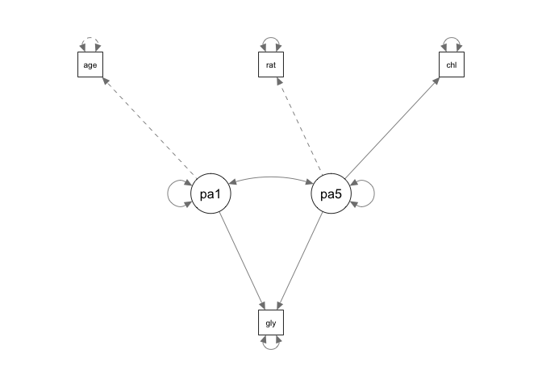

``` r
summary(fit2, standardized = TRUE, fit.measures = TRUE)
```

    ## lavaan 0.6-2 ended normally after 21 iterations
    ## 
    ##   Optimization method                           NLMINB
    ##   Number of free parameters                          9
    ## 
    ##   Number of observations                           390
    ## 
    ##   Estimator                                         ML
    ##   Model Fit Test Statistic                       7.350
    ##   Degrees of freedom                                 1
    ##   P-value (Chi-square)                           0.007
    ## 
    ## Model test baseline model:
    ## 
    ##   Minimum Function Test Statistic              210.710
    ##   Degrees of freedom                                 6
    ##   P-value                                        0.000
    ## 
    ## User model versus baseline model:
    ## 
    ##   Comparative Fit Index (CFI)                    0.969
    ##   Tucker-Lewis Index (TLI)                       0.814
    ## 
    ## Loglikelihood and Information Criteria:
    ## 
    ##   Loglikelihood user model (H0)              -2109.862
    ##   Loglikelihood unrestricted model (H1)      -2106.186
    ## 
    ##   Number of free parameters                          9
    ##   Akaike (AIC)                                4237.723
    ##   Bayesian (BIC)                              4273.418
    ##   Sample-size adjusted Bayesian (BIC)         4244.862
    ## 
    ## Root Mean Square Error of Approximation:
    ## 
    ##   RMSEA                                          0.128
    ##   90 Percent Confidence Interval          0.054  0.221
    ##   P-value RMSEA <= 0.05                          0.042
    ## 
    ## Standardized Root Mean Square Residual:
    ## 
    ##   SRMR                                           0.027
    ## 
    ## Parameter Estimates:
    ## 
    ##   Information                                 Expected
    ##   Information saturated (h1) model          Structured
    ##   Standard Errors                             Standard
    ## 
    ## Latent Variables:
    ##                    Estimate  Std.Err  z-value  P(>|z|)   Std.lv  Std.all
    ##   pa1 =~                                                                
    ##     age               1.000                               0.999    1.000
    ##   pa5 =~                                                                
    ##     ratio             1.000                               0.733    0.734
    ##     chol              0.885    0.149    5.938    0.000    0.649    0.650
    ## 
    ## Regressions:
    ##                    Estimate  Std.Err  z-value  P(>|z|)   Std.lv  Std.all
    ##   glyhb ~                                                               
    ##     pa1               0.238    0.050    4.789    0.000    0.238    0.238
    ##     pa5               0.485    0.099    4.903    0.000    0.355    0.356
    ## 
    ## Covariances:
    ##                    Estimate  Std.Err  z-value  P(>|z|)   Std.lv  Std.all
    ##   pa1 ~~                                                                
    ##     pa5               0.207    0.049    4.237    0.000    0.283    0.283
    ## 
    ## Variances:
    ##                    Estimate  Std.Err  z-value  P(>|z|)   Std.lv  Std.all
    ##    .age               0.000                               0.000    0.000
    ##    .ratio             0.460    0.092    4.991    0.000    0.460    0.461
    ##    .chol              0.576    0.079    7.283    0.000    0.576    0.578
    ##    .glyhb             0.767    0.060   12.771    0.000    0.767    0.769
    ##     pa1               0.997    0.071   13.964    0.000    1.000    1.000
    ##     pa5               0.537    0.107    5.027    0.000    1.000    1.000

``` r
parameterEstimates(fit1)
```

    ##                 lhs op              rhs    est    se      z pvalue
    ## 1               pa1 =~              age  1.000 0.000     NA     NA
    ## 2               pa2 =~            bp.1d  1.000 0.000     NA     NA
    ## 3               pa2 =~            bp.1s  5.235 2.648  1.977  0.048
    ## 4               pa3 =~              bmi  1.000 0.000     NA     NA
    ## 5               pa3 =~      frame_large  0.483 0.072  6.705  0.000
    ## 6               pa3 =~      frame_small -0.543 0.080 -6.793  0.000
    ## 7               pa4 =~      gender_male  1.000 0.000     NA     NA
    ## 8               pa4 =~ waist_to_hip_rat  6.946 2.881  2.411  0.016
    ## 9               pa5 =~            ratio  1.000 0.000     NA     NA
    ## 10              pa5 =~             chol  0.612 0.106  5.760  0.000
    ## 11              pa6 =~         time.ppn  1.000 0.000     NA     NA
    ## 12            glyhb  ~              pa1  0.257 0.049  5.254  0.000
    ## 13            glyhb  ~              pa2  0.055 0.061  0.892  0.372
    ## 14            glyhb  ~              pa3  0.063 0.134  0.469  0.639
    ## 15            glyhb  ~              pa4  0.132 0.290  0.456  0.648
    ## 16            glyhb  ~              pa5  0.351 0.090  3.916  0.000
    ## 17            glyhb  ~              pa6  0.056 0.046  1.222  0.222
    ## 18              age ~~              age  0.000 0.000     NA     NA
    ## 19            bp.1d ~~            bp.1d  0.882 0.084 10.560  0.000
    ## 20            bp.1s ~~            bp.1s -2.164 1.506 -1.437  0.151
    ## 21              bmi ~~              bmi  0.714 0.065 10.975  0.000
    ## 22      frame_large ~~      frame_large  0.126 0.013  9.944  0.000
    ## 23      frame_small ~~      frame_small  0.113 0.014  8.366  0.000
    ## 24      gender_male ~~      gender_male  0.218 0.018 11.936  0.000
    ## 25 waist_to_hip_rat ~~ waist_to_hip_rat -0.199 0.458 -0.435  0.664
    ## 26            ratio ~~            ratio  0.219 0.124  1.771  0.077
    ## 27             chol ~~             chol  0.706 0.068 10.337  0.000
    ## 28         time.ppn ~~         time.ppn  0.000 0.000     NA     NA
    ## 29            glyhb ~~            glyhb  0.777 0.059 13.243  0.000
    ## 30              pa1 ~~              pa1  0.997 0.071 13.964  0.000
    ## 31              pa2 ~~              pa2  0.115 0.064  1.802  0.072
    ## 32              pa3 ~~              pa3  0.283 0.064  4.423  0.000
    ## 33              pa4 ~~              pa4  0.025 0.012  2.035  0.042
    ## 34              pa5 ~~              pa5  0.778 0.141  5.508  0.000
    ## 35              pa6 ~~              pa6  0.997 0.071 13.964  0.000
    ## 36              pa1 ~~              pa2  0.088 0.050  1.766  0.077
    ## 37              pa1 ~~              pa3  0.130 0.037  3.510  0.000
    ## 38              pa1 ~~              pa4  0.040 0.019  2.163  0.031
    ## 39              pa1 ~~              pa5  0.187 0.051  3.681  0.000
    ## 40              pa1 ~~              pa6 -0.039 0.051 -0.778  0.437
    ## 41              pa2 ~~              pa3  0.019 0.012  1.564  0.118
    ## 42              pa2 ~~              pa4  0.003 0.003  1.249  0.212
    ## 43              pa2 ~~              pa5  0.023 0.015  1.499  0.134
    ## 44              pa2 ~~              pa6 -0.008 0.010 -0.840  0.401
    ## 45              pa3 ~~              pa4  0.027 0.013  2.113  0.035
    ## 46              pa3 ~~              pa5  0.182 0.039  4.618  0.000
    ## 47              pa3 ~~              pa6  0.036 0.034  1.062  0.288
    ## 48              pa4 ~~              pa5  0.034 0.016  2.109  0.035
    ## 49              pa4 ~~              pa6  0.000 0.007  0.003  0.998
    ## 50              pa5 ~~              pa6 -0.037 0.050 -0.733  0.464
    ##    ci.lower ci.upper
    ## 1     1.000    1.000
    ## 2     1.000    1.000
    ## 3     0.046   10.425
    ## 4     1.000    1.000
    ## 5     0.341    0.624
    ## 6    -0.700   -0.386
    ## 7     1.000    1.000
    ## 8     1.300   12.592
    ## 9     1.000    1.000
    ## 10    0.403    0.820
    ## 11    1.000    1.000
    ## 12    0.161    0.353
    ## 13   -0.065    0.174
    ## 14   -0.199    0.325
    ## 15   -0.436    0.700
    ## 16    0.175    0.527
    ## 17   -0.034    0.146
    ## 18    0.000    0.000
    ## 19    0.718    1.046
    ## 20   -5.116    0.787
    ## 21    0.587    0.842
    ## 22    0.101    0.151
    ## 23    0.087    0.140
    ## 24    0.182    0.254
    ## 25   -1.096    0.698
    ## 26   -0.023    0.462
    ## 27    0.573    0.840
    ## 28    0.000    0.000
    ## 29    0.662    0.892
    ## 30    0.857    1.137
    ## 31   -0.010    0.241
    ## 32    0.158    0.409
    ## 33    0.001    0.049
    ## 34    0.501    1.055
    ## 35    0.857    1.137
    ## 36   -0.010    0.186
    ## 37    0.057    0.203
    ## 38    0.004    0.077
    ## 39    0.088    0.287
    ## 40   -0.138    0.060
    ## 41   -0.005    0.044
    ## 42   -0.002    0.008
    ## 43   -0.007    0.053
    ## 44   -0.027    0.011
    ## 45    0.002    0.052
    ## 46    0.105    0.260
    ## 47   -0.031    0.104
    ## 48    0.002    0.067
    ## 49   -0.014    0.014
    ## 50   -0.135    0.061
