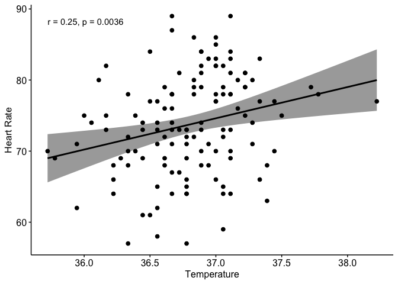

Correlation Analysis
================
Murat Koptur
24 Ağustos 2018

``` r
library(ggpubr)
```

    ## Loading required package: ggplot2

    ## Loading required package: magrittr

``` r
library(haven)
```

``` r
temprate <- read_sav("../data/temprate.sav")
head(temprate)
```

    ## # A tibble: 6 x 2
    ##    temp hrtrate
    ##   <dbl>   <dbl>
    ## 1  35.7      70
    ## 2  35.9      71
    ## 3  36.1      74
    ## 4  36.1      80
    ## 5  36.2      73
    ## 6  36.2      75

``` r
cor.test(temprate$temp, temprate$hrtrate, method = "pearson")
```

    ## 
    ##  Pearson's product-moment correlation
    ## 
    ## data:  temprate$temp and temprate$hrtrate
    ## t = 2.9668, df = 128, p-value = 0.003591
    ## alternative hypothesis: true correlation is not equal to 0
    ## 95 percent confidence interval:
    ##  0.08519113 0.40802170
    ## sample estimates:
    ##       cor 
    ## 0.2536564

``` r
ggscatter(
  data = temprate,
  x = "temp",
  y = "hrtrate",
  add = "reg.line",
  conf.int = TRUE,
  cor.coef = TRUE,
  cor.method = "pearson",
  xlab = "Temperature",
  ylab = "Heart Rate"
)
```


