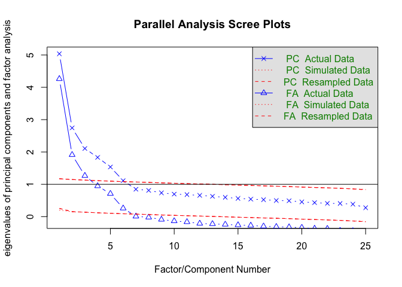
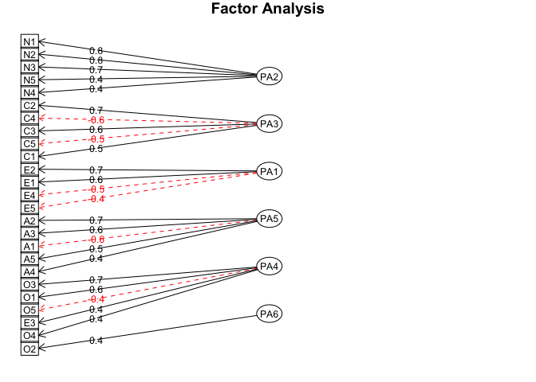

Factor Analysis
================
Murat Koptur
24 Ağustos 2018

``` r
library(readr)
library(knitr)
library(psych)
```

``` r
bfi <- read_csv("../data/bfi.csv", 
    col_types = cols(X1 = col_skip(), age = col_skip(), 
        education = col_skip(), gender = col_skip()))
```

    ## Warning: Missing column names filled in: 'X1' [1]

    ## Warning in read_tokens_(data, tokenizer, col_specs, col_names, locale_, :
    ## length of NULL cannot be changed

    ## Warning in read_tokens_(data, tokenizer, col_specs, col_names, locale_, :
    ## length of NULL cannot be changed

    ## Warning in read_tokens_(data, tokenizer, col_specs, col_names, locale_, :
    ## length of NULL cannot be changed

    ## Warning in read_tokens_(data, tokenizer, col_specs, col_names, locale_, :
    ## length of NULL cannot be changed

    ## Warning in read_tokens_(data, tokenizer, col_specs, col_names, locale_, :
    ## length of NULL cannot be changed

    ## Warning in read_tokens_(data, tokenizer, col_specs, col_names, locale_, :
    ## length of NULL cannot be changed

    ## Warning in read_tokens_(data, tokenizer, col_specs, col_names, locale_, :
    ## length of NULL cannot be changed

    ## Warning in read_tokens_(data, tokenizer, col_specs, col_names, locale_, :
    ## length of NULL cannot be changed

    ## Warning in read_tokens_(data, tokenizer, col_specs, col_names, locale_, :
    ## length of NULL cannot be changed

    ## Warning in read_tokens_(data, tokenizer, col_specs, col_names, locale_, :
    ## length of NULL cannot be changed

    ## Warning in read_tokens_(data, tokenizer, col_specs, col_names, locale_, :
    ## length of NULL cannot be changed

    ## Warning in read_tokens_(data, tokenizer, col_specs, col_names, locale_, :
    ## length of NULL cannot be changed

``` r
kable(head(bfi))
```

|   A1|   A2|   A3|   A4|   A5|   C1|   C2|   C3|   C4|   C5|   E1|   E2|   E3|   E4|   E5|   N1|   N2|   N3|   N4|   N5|   O1|   O2|   O3|   O4|   O5|
|----:|----:|----:|----:|----:|----:|----:|----:|----:|----:|----:|----:|----:|----:|----:|----:|----:|----:|----:|----:|----:|----:|----:|----:|----:|
|    2|    4|    3|    4|    4|    2|    3|    3|    4|    4|    3|    3|    3|    4|    4|    3|    4|    2|    2|    3|    3|    6|    3|    4|    3|
|    2|    4|    5|    2|    5|    5|    4|    4|    3|    4|    1|    1|    6|    4|    3|    3|    3|    3|    5|    5|    4|    2|    4|    3|    3|
|    5|    4|    5|    4|    4|    4|    5|    4|    2|    5|    2|    4|    4|    4|    5|    4|    5|    4|    2|    3|    4|    2|    5|    5|    2|
|    4|    4|    6|    5|    5|    4|    4|    3|    5|    5|    5|    3|    4|    4|    4|    2|    5|    2|    4|    1|    3|    3|    4|    3|    5|
|    2|    3|    3|    4|    5|    4|    4|    5|    3|    2|    2|    2|    5|    4|    5|    2|    3|    4|    4|    3|    3|    3|    4|    3|    3|
|    6|    6|    5|    6|    5|    6|    6|    6|    1|    3|    2|    1|    6|    5|    6|    3|    5|    2|    2|    3|    4|    3|    5|    6|    1|

``` r
KMO(bfi)
```

    ## Kaiser-Meyer-Olkin factor adequacy
    ## Call: KMO(r = bfi)
    ## Overall MSA =  0.85
    ## MSA for each item = 
    ##   A1   A2   A3   A4   A5   C1   C2   C3   C4   C5   E1   E2   E3   E4   E5 
    ## 0.74 0.84 0.87 0.87 0.90 0.83 0.79 0.85 0.82 0.86 0.83 0.88 0.89 0.87 0.89 
    ##   N1   N2   N3   N4   N5   O1   O2   O3   O4   O5 
    ## 0.78 0.78 0.86 0.88 0.86 0.85 0.78 0.84 0.76 0.76

``` r
fa.parallel(bfi)
```



    ## Parallel analysis suggests that the number of factors =  6  and the number of components =  6

``` r
bfi.fa <- fa(bfi, nfactors = 6, fm="pa", max.iter = 100)
```

    ## Loading required namespace: GPArotation

``` r
fa.diagram(bfi.fa)
```


