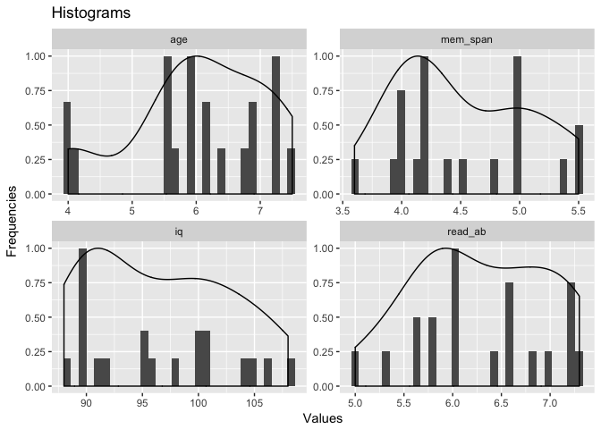

Multiple Linear Regression with interaction terms
================
Murat Koptur
24 Ağustos 2018

``` r
library(GGally) 
```

    ## Loading required package: ggplot2

``` r
library(ggplot2)
library(readr)
library(reshape2)
```

``` r
child_data <- read_csv("../data/child_data.csv")
```

    ## Parsed with column specification:
    ## cols(
    ##   age = col_double(),
    ##   mem_span = col_double(),
    ##   iq = col_integer(),
    ##   read_ab = col_double()
    ## )

``` r
head(child_data)
```

    ## # A tibble: 6 x 4
    ##     age mem_span    iq read_ab
    ##   <dbl>    <dbl> <int>   <dbl>
    ## 1   6.7      4.4    95     7.2
    ## 2   5.9      4      90     6  
    ## 3   5.5      4.1   105     6  
    ## 4   6.2      4.8    98     6.6
    ## 5   6.4      5     106     7  
    ## 6   7.3      5.5   100     7.2

``` r
child_data_melted <- melt(child_data)
```

    ## No id variables; using all as measure variables

``` r
head(child_data_melted)
```

    ##   variable value
    ## 1      age   6.7
    ## 2      age   5.9
    ## 3      age   5.5
    ## 4      age   6.2
    ## 5      age   6.4
    ## 6      age   7.3

``` r
ggplot(data = child_data_melted, aes(x = value)) + 
  geom_histogram(aes(y = ..ncount..)) + 
  geom_density(aes(y = ..scaled..)) + 
  facet_wrap(~variable, scales = "free") +
  labs(x = "Values", y = "Frequencies", title = "Histograms")
```

    ## `stat_bin()` using `bins = 30`. Pick better value with `binwidth`.



``` r
ggpairs(child_data)
```


``` r
child_data_scaled <- scale(child_data)
head(child_data_scaled)
```

    ##             age   mem_span         iq   read_ab
    ## [1,]  0.6268603 -0.2164352 -0.2376403  1.309125
    ## [2,] -0.1188471 -0.9090277 -1.0297747 -0.436375
    ## [3,] -0.4917008 -0.7358796  1.3466285 -0.436375
    ## [4,]  0.1607932  0.4761574  0.2376403  0.436375
    ## [5,]  0.3472200  0.8224536  1.5050553  1.018208
    ## [6,]  1.1861409  1.6881943  0.5544941  1.309125

``` r
model1 <- lm(read_ab ~ age + iq, data = as.data.frame(child_data_scaled))
summary(model1)
```

    ## 
    ## Call:
    ## lm(formula = read_ab ~ age + iq, data = as.data.frame(child_data_scaled))
    ## 
    ## Residuals:
    ##      Min       1Q   Median       3Q      Max 
    ## -0.85644 -0.02059  0.04402  0.20506  0.81633 
    ## 
    ## Coefficients:
    ##               Estimate Std. Error t value Pr(>|t|)    
    ## (Intercept) -2.302e-16  9.998e-02   0.000  1.00000    
    ## age          9.117e-01  1.047e-01   8.711 1.12e-07 ***
    ## iq           3.313e-01  1.047e-01   3.165  0.00565 ** 
    ## ---
    ## Signif. codes:  0 '***' 0.001 '**' 0.01 '*' 0.05 '.' 0.1 ' ' 1
    ## 
    ## Residual standard error: 0.4471 on 17 degrees of freedom
    ## Multiple R-squared:  0.8211, Adjusted R-squared:  0.8001 
    ## F-statistic: 39.02 on 2 and 17 DF,  p-value: 4.434e-07

``` r
model2 <- lm(read_ab ~ age + mem_span, data = as.data.frame(child_data_scaled))
summary(model2)
```

    ## 
    ## Call:
    ## lm(formula = read_ab ~ age + mem_span, data = as.data.frame(child_data_scaled))
    ## 
    ## Residuals:
    ##     Min      1Q  Median      3Q     Max 
    ## -0.9536 -0.2206  0.0244  0.1668  1.0719 
    ## 
    ## Coefficients:
    ##              Estimate Std. Error t value Pr(>|t|)   
    ## (Intercept) 1.363e-16  1.038e-01   0.000  1.00000   
    ## age         5.296e-01  1.542e-01   3.435  0.00316 **
    ## mem_span    4.377e-01  1.542e-01   2.839  0.01135 * 
    ## ---
    ## Signif. codes:  0 '***' 0.001 '**' 0.01 '*' 0.05 '.' 0.1 ' ' 1
    ## 
    ## Residual standard error: 0.4643 on 17 degrees of freedom
    ## Multiple R-squared:  0.8071, Adjusted R-squared:  0.7844 
    ## F-statistic: 35.57 on 2 and 17 DF,  p-value: 8.414e-07

``` r
model3 <- lm(read_ab ~ age + iq + age:iq, data = as.data.frame(child_data_scaled))
summary(model3)
```

    ## 
    ## Call:
    ## lm(formula = read_ab ~ age + iq + age:iq, data = as.data.frame(child_data_scaled))
    ## 
    ## Residuals:
    ##      Min       1Q   Median       3Q      Max 
    ## -0.82042 -0.08630 -0.01172  0.18550  0.89331 
    ## 
    ## Coefficients:
    ##             Estimate Std. Error t value Pr(>|t|)    
    ## (Intercept)  0.03942    0.09964   0.396  0.69764    
    ## age          0.79560    0.12613   6.308 1.04e-05 ***
    ## iq           0.38369    0.10642   3.605  0.00237 ** 
    ## age:iq       0.20914    0.13667   1.530  0.14549    
    ## ---
    ## Signif. codes:  0 '***' 0.001 '**' 0.01 '*' 0.05 '.' 0.1 ' ' 1
    ## 
    ## Residual standard error: 0.4305 on 16 degrees of freedom
    ## Multiple R-squared:  0.844,  Adjusted R-squared:  0.8147 
    ## F-statistic: 28.85 on 3 and 16 DF,  p-value: 1.089e-06
