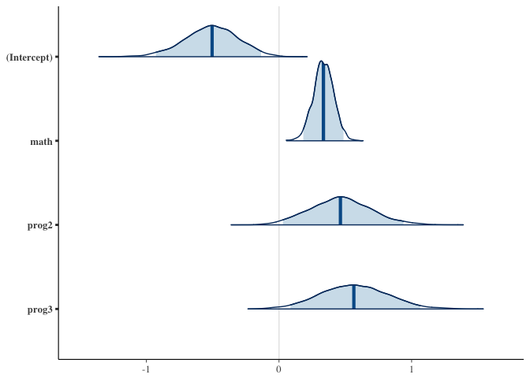
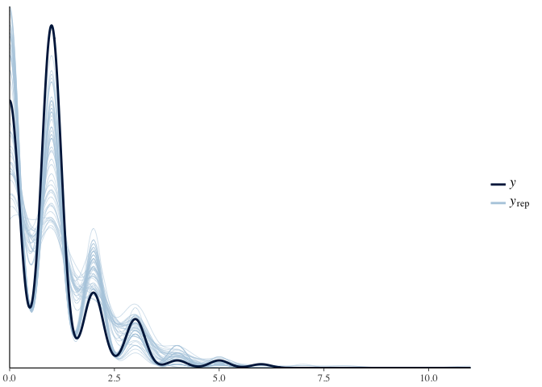

Poisson Regression
================
Murat Koptur
24 Ağustos 2018

``` r
library(bayesplot)
```

    ## This is bayesplot version 1.6.0

    ## - Online documentation and vignettes at mc-stan.org/bayesplot

    ## - bayesplot theme set to bayesplot::theme_default()

    ##    * Does _not_ affect other ggplot2 plots

    ##    * See ?bayesplot_theme_set for details on theme setting

``` r
library(ggplot2)
library(readr)
library(reshape2)
library(rstanarm)
```

    ## Loading required package: Rcpp

    ## rstanarm (Version 2.17.4, packaged: 2018-04-13 01:51:52 UTC)

    ## - Do not expect the default priors to remain the same in future rstanarm versions.

    ## Thus, R scripts should specify priors explicitly, even if they are just the defaults.

    ## - For execution on a local, multicore CPU with excess RAM we recommend calling

    ## options(mc.cores = parallel::detectCores())

    ## - Plotting theme set to bayesplot::theme_default().

``` r
awards <- read_csv("../data/awards.csv",
                   col_types = cols(id = col_skip(), prog = col_factor(levels = c("1", "2", "3"))))
```

    ## Warning in read_tokens_(data, tokenizer, col_specs, col_names, locale_, :
    ## length of NULL cannot be changed

    ## Warning in read_tokens_(data, tokenizer, col_specs, col_names, locale_, :
    ## length of NULL cannot be changed

``` r
head(awards)
```

    ## # A tibble: 6 x 3
    ##   num_awards prog   math
    ##        <int> <fct> <int>
    ## 1          1 3        41
    ## 2          1 1        41
    ## 3          1 3        44
    ## 4          1 3        42
    ## 5          1 3        40
    ## 6          1 1        42

``` r
awards_melted <- melt(awards)
```

    ## Using prog as id variables

``` r
head(awards_melted)
```

    ##   prog   variable value
    ## 1    3 num_awards     1
    ## 2    1 num_awards     1
    ## 3    3 num_awards     1
    ## 4    3 num_awards     1
    ## 5    3 num_awards     1
    ## 6    1 num_awards     1

``` r
ggplot(data = awards_melted, aes(x = value)) + 
  geom_histogram(aes(y = ..ncount..)) + 
  geom_density(aes(y = ..scaled..)) + 
  facet_wrap(~variable, scales = "free") +
  labs(x = "Values", y = "Frequencies", title = "Histograms")
```

    ## `stat_bin()` using `bins = 30`. Pick better value with `binwidth`.


``` r
awards$math <- scale(awards$math)
```

``` r
model1 <- glm(num_awards ~ math + prog, data = awards, family = poisson)
summary(model1)
```

    ## 
    ## Call:
    ## glm(formula = num_awards ~ math + prog, family = poisson, data = awards)
    ## 
    ## Deviance Residuals: 
    ##      Min        1Q    Median        3Q       Max  
    ## -1.96335  -1.14818  -0.01392   0.35710   2.52541  
    ## 
    ## Coefficients:
    ##             Estimate Std. Error z value Pr(>|z|)    
    ## (Intercept) -0.48897    0.19620  -2.492   0.0127 *  
    ## math         0.33520    0.07817   4.288  1.8e-05 ***
    ## prog2        0.45262    0.22475   2.014   0.0440 *  
    ## prog3        0.56172    0.24748   2.270   0.0232 *  
    ## ---
    ## Signif. codes:  0 '***' 0.001 '**' 0.01 '*' 0.05 '.' 0.1 ' ' 1
    ## 
    ## (Dispersion parameter for poisson family taken to be 1)
    ## 
    ##     Null deviance: 228.83  on 199  degrees of freedom
    ## Residual deviance: 198.05  on 196  degrees of freedom
    ## AIC: 496.36
    ## 
    ## Number of Fisher Scoring iterations: 5

``` r
model2 <- stan_glm(num_awards ~ math + prog, data = awards, family = poisson,
                   prior = normal(0, 10), prior_intercept = normal(0, 10))
```

    ## 
    ## SAMPLING FOR MODEL 'count' NOW (CHAIN 1).
    ## 
    ## Gradient evaluation took 0.00012 seconds
    ## 1000 transitions using 10 leapfrog steps per transition would take 1.2 seconds.
    ## Adjust your expectations accordingly!
    ## 
    ## 
    ## Iteration:    1 / 2000 [  0%]  (Warmup)
    ## Iteration:  200 / 2000 [ 10%]  (Warmup)
    ## Iteration:  400 / 2000 [ 20%]  (Warmup)
    ## Iteration:  600 / 2000 [ 30%]  (Warmup)
    ## Iteration:  800 / 2000 [ 40%]  (Warmup)
    ## Iteration: 1000 / 2000 [ 50%]  (Warmup)
    ## Iteration: 1001 / 2000 [ 50%]  (Sampling)
    ## Iteration: 1200 / 2000 [ 60%]  (Sampling)
    ## Iteration: 1400 / 2000 [ 70%]  (Sampling)
    ## Iteration: 1600 / 2000 [ 80%]  (Sampling)
    ## Iteration: 1800 / 2000 [ 90%]  (Sampling)
    ## Iteration: 2000 / 2000 [100%]  (Sampling)
    ## 
    ##  Elapsed Time: 0.236298 seconds (Warm-up)
    ##                0.256971 seconds (Sampling)
    ##                0.493269 seconds (Total)
    ## 
    ## 
    ## SAMPLING FOR MODEL 'count' NOW (CHAIN 2).
    ## 
    ## Gradient evaluation took 3.1e-05 seconds
    ## 1000 transitions using 10 leapfrog steps per transition would take 0.31 seconds.
    ## Adjust your expectations accordingly!
    ## 
    ## 
    ## Iteration:    1 / 2000 [  0%]  (Warmup)
    ## Iteration:  200 / 2000 [ 10%]  (Warmup)
    ## Iteration:  400 / 2000 [ 20%]  (Warmup)
    ## Iteration:  600 / 2000 [ 30%]  (Warmup)
    ## Iteration:  800 / 2000 [ 40%]  (Warmup)
    ## Iteration: 1000 / 2000 [ 50%]  (Warmup)
    ## Iteration: 1001 / 2000 [ 50%]  (Sampling)
    ## Iteration: 1200 / 2000 [ 60%]  (Sampling)
    ## Iteration: 1400 / 2000 [ 70%]  (Sampling)
    ## Iteration: 1600 / 2000 [ 80%]  (Sampling)
    ## Iteration: 1800 / 2000 [ 90%]  (Sampling)
    ## Iteration: 2000 / 2000 [100%]  (Sampling)
    ## 
    ##  Elapsed Time: 0.272622 seconds (Warm-up)
    ##                0.282284 seconds (Sampling)
    ##                0.554906 seconds (Total)
    ## 
    ## 
    ## SAMPLING FOR MODEL 'count' NOW (CHAIN 3).
    ## 
    ## Gradient evaluation took 3.1e-05 seconds
    ## 1000 transitions using 10 leapfrog steps per transition would take 0.31 seconds.
    ## Adjust your expectations accordingly!
    ## 
    ## 
    ## Iteration:    1 / 2000 [  0%]  (Warmup)
    ## Iteration:  200 / 2000 [ 10%]  (Warmup)
    ## Iteration:  400 / 2000 [ 20%]  (Warmup)
    ## Iteration:  600 / 2000 [ 30%]  (Warmup)
    ## Iteration:  800 / 2000 [ 40%]  (Warmup)
    ## Iteration: 1000 / 2000 [ 50%]  (Warmup)
    ## Iteration: 1001 / 2000 [ 50%]  (Sampling)
    ## Iteration: 1200 / 2000 [ 60%]  (Sampling)
    ## Iteration: 1400 / 2000 [ 70%]  (Sampling)
    ## Iteration: 1600 / 2000 [ 80%]  (Sampling)
    ## Iteration: 1800 / 2000 [ 90%]  (Sampling)
    ## Iteration: 2000 / 2000 [100%]  (Sampling)
    ## 
    ##  Elapsed Time: 0.280228 seconds (Warm-up)
    ##                0.257846 seconds (Sampling)
    ##                0.538074 seconds (Total)
    ## 
    ## 
    ## SAMPLING FOR MODEL 'count' NOW (CHAIN 4).
    ## 
    ## Gradient evaluation took 3e-05 seconds
    ## 1000 transitions using 10 leapfrog steps per transition would take 0.3 seconds.
    ## Adjust your expectations accordingly!
    ## 
    ## 
    ## Iteration:    1 / 2000 [  0%]  (Warmup)
    ## Iteration:  200 / 2000 [ 10%]  (Warmup)
    ## Iteration:  400 / 2000 [ 20%]  (Warmup)
    ## Iteration:  600 / 2000 [ 30%]  (Warmup)
    ## Iteration:  800 / 2000 [ 40%]  (Warmup)
    ## Iteration: 1000 / 2000 [ 50%]  (Warmup)
    ## Iteration: 1001 / 2000 [ 50%]  (Sampling)
    ## Iteration: 1200 / 2000 [ 60%]  (Sampling)
    ## Iteration: 1400 / 2000 [ 70%]  (Sampling)
    ## Iteration: 1600 / 2000 [ 80%]  (Sampling)
    ## Iteration: 1800 / 2000 [ 90%]  (Sampling)
    ## Iteration: 2000 / 2000 [100%]  (Sampling)
    ## 
    ##  Elapsed Time: 0.256981 seconds (Warm-up)
    ##                0.29209 seconds (Sampling)
    ##                0.549071 seconds (Total)

``` r
summary(model2)
```

    ## 
    ## Model Info:
    ## 
    ##  function:     stan_glm
    ##  family:       poisson [log]
    ##  formula:      num_awards ~ math + prog
    ##  algorithm:    sampling
    ##  priors:       see help('prior_summary')
    ##  sample:       4000 (posterior sample size)
    ##  observations: 200
    ##  predictors:   4
    ## 
    ## Estimates:
    ##                 mean   sd     2.5%   25%    50%    75%    97.5%
    ## (Intercept)     -0.5    0.2   -0.9   -0.6   -0.5   -0.4   -0.1 
    ## math             0.3    0.1    0.2    0.3    0.3    0.4    0.5 
    ## prog2            0.5    0.2    0.0    0.3    0.5    0.6    0.9 
    ## prog3            0.6    0.3    0.1    0.4    0.6    0.7    1.1 
    ## mean_PPD         1.0    0.1    0.8    0.9    1.0    1.0    1.2 
    ## log-posterior -252.2    1.4 -255.9 -252.8 -251.8 -251.1 -250.4 
    ## 
    ## Diagnostics:
    ##               mcse Rhat n_eff
    ## (Intercept)   0.0  1.0  1650 
    ## math          0.0  1.0  2690 
    ## prog2         0.0  1.0  1911 
    ## prog3         0.0  1.0  1820 
    ## mean_PPD      0.0  1.0  3438 
    ## log-posterior 0.0  1.0  1664 
    ## 
    ## For each parameter, mcse is Monte Carlo standard error, n_eff is a crude measure of effective sample size, and Rhat is the potential scale reduction factor on split chains (at convergence Rhat=1).

``` r
posterior_interval(model2, prob = 0.95)
```

    ##                    2.5%      97.5%
    ## (Intercept) -0.92868856 -0.1355184
    ## math         0.18303731  0.4864172
    ## prog2        0.02950207  0.9384001
    ## prog3        0.08602003  1.0644818

``` r
plot(model2, plotfun = "areas", prob = 0.95)
```



``` r
pp_check(model2)
```


